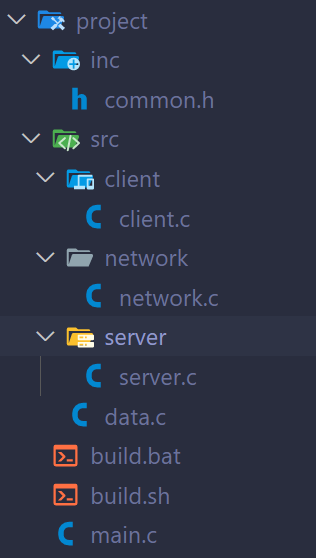

# Bài thi cuối khóa - Khóa học lập trình C nâng cao

Yêu cầu: Các bài tập được lưu vào thư mục có tên tương ứng, VD B1 tạo thư mục B1 để lưu, B2 tạo thư mục B2 để lưu

Khi kết thúc bài thi, cần nén .zip lại toàn bộ bài giải thành 1 file .zip duy nhất và đẩy lên Assignment

**## I. Lý thuyết (tối đa 4 điểm)** 

**### B1: Biên dịch**

Cho cấu trúc thư mục dự án như sau:



Viết lệnh biên dịch dự án trên theo yêu cầu sau:
- Biên dịch tất cả các file *.c có trong dự án
- Cần có cờ -I (gạch i, không phải gạch lờ) để trình biên dịch sẽ tìm kiểm file *.h trong thư mục inc/
- Cần có các cờ sau: 
    - `-Wall`
    - `-Wextra`
    - `-O3`
- File đầu ra sẽ có tên program.exe (Win) hoặc program.out (Mac/Linux)

**### B2. Cấp phát động mảng một chiều**

***#### B2.1: Viết chương trình C cấp phát động 105 phần tử cho mảng các số nguyên sau, gán tất cả các giá trị của mảng bằng 0 và sau đó giải phóng bộ nhớ cho con trỏ***

```
int main() {
    uint16_t* arr;
    // Cap phat dong va gan gia tri cho cac phan tu mang o day

    // Giai phong bo nho o day

}
```

***#### B2.2: Viết chương trình C nhận vào 1 số nguyên dương n, cấp phát động mảng số thực gồm n phần tử, gán giá trị sao cho phần tử đầu tiên có giá trị 1, phần tử thứ 2 có giá trị 2, ..., phần tử thứ n có giá trị n. In toàn bộ giá trị các phần tử ra màn hình, mỗi phần tử in trên 1 dòng, bắt buộc có 3 chữ số sau dấu phẩy. Sau đó giải phóng bộ nhớ.***

Input:
```
5
```

Output:
```
1.000
2.000
3.000
4.000
5.000
```

**### B3. Nhập xuất trong C**

Cho đoạn văn bản sau:
```
Hello World
 Hello World
  Hello World
   Hello World
    Hello World
     Hello World
    Hello World: Hello World
   Hello World:  Hello World
  Hello World:   Hello World
 Hello World:    Hello World
Hello World:     Hello World
```

Viết chương trình C in ra màn hình đoạn văn bản trên, chỉ được sử dụng hàm `printf()` để in.
Yêu cầu: 
- Không sử dụng vòng lặp. Có thể dùng nhiều lần hàm `printf()`
- Chuỗi truyền vào `printf()` không được chứa 2 dấu cách liền nhau
    - VD: printf("abc") và printf("a b c") là hợp lệ vì tối đa chỉ có 1 dấu cách liền nhau
    - VD: printf("a  bc") và printf("ab      c") không hợp lệ vì có nhiều dấu cách liền nhau

**### B4. Sử dụng struct**

Cho struct sau:
```
struct student {
    int grade; // Khối lớp 1, 2, 3, ..., 12
    double height; // Chiều cao
    char* name; // Tên
}
```

Biết rằng mỗi học sinh có tên tối đa 30 ký tự.
Viết chương trình C nhận vào số n, sau đó nhận lần lượt thông tin n học sinh theo thứ tự grade, height, name theo từng dòng.
In ra thông tin mỗi học sinh ra màn hình theo định dạng sau, biết rằng khi in thông tin nhiều sinh viên thì giữa 2 sinh viên không có dòng trống
```
Sinh vien thu: <thu tu sinh vien nhap vao>
Khoi lop: <khoi lop>
Chieu cao: <chieu cao>
Ten: <ten>
```

Yêu cầu: Sử dụng cấp phát động để lưu thông tin sinh viên (Chú ý tên sinh viên cũng cần cấp phát động)

Input:
```
2
12
172.12
Nguyen Van A
6
151.456
Nguyen Van B
```

Output:
```
Sinh vien thu: 1
Khoi lop: 12
Chieu cao: 172.12
Ten: Nguyen Van A
Sinh vien thu: 2
Khoi lop: 6
Chieu cao: 151.456
Ten: Nguyen Van B
```

**### B5. Sửa lỗi**

Cho file code 
```
int main() {
    uint8_t a = 9;
    uint8_t* p_a = a;

    double b;
    scanf("%d", b);
    printf("%15.g", b);
}
```
Tự viết lệnh biên dịch code lưu vào build.bat (Win) hoặc build.sh (Mac, Linux)
Viết lệnh chạy code vào file run.bat hoặc run.sh

Yêu cầu: Khi chạy build.bat/build.sh thì không có lỗi. Khi chạy run.bat/run.sh thì phần mềm cần chạy được

**## II. Thực hành (6-9 điểm)**

Chọn 1 trong 2 đề II.1 (tối đa 6 điểm, trong đó bài thực hành Complex Calculator chiếm tối đa 3 điểm) hoặc II.2 (tối đa 9 điểm)

**### II.1. Kiểm tra khả năng lập trình nhập xuất**


***#### B7. Nhận vào một chuỗi từ bàn phím, tách các trường dữ liệu và in ra màn hình***

**Định dạng input**: [Name - tối đa 30 ký tự],[ID - 8 ký tự],[Class - tối đa 9 ký tự],[Generation - 3 ký tự,[GPA - số thực]  
**Output format**: Name, ID, Class, Generation, GPA trên 5 dòng. Chú ý GPA phải có định dạng `x.xx`.

**Input:** Chuỗi (1 - 100 ký tự)

```
Tran Quang Huy,20210428,ET1-05,K66,2.5
```

**Output:** Mỗi thông tin trên 1 dòng

```plaintext
Tran Quang Huy
20210428
ET1-05
K66
2.50
```

***#### B8. Nhận vào một chuỗi từ bàn phím, tách các trường dữ liệu và in ra màn hình***

**Định dạng input**: {request:[Request - tối đa 10 ký tự],value:{[real1] + [imagine1]i,[real2] + [imagine2]i}}  
**Định dạng output**: 
```
Yeu cau: "[Request]"
So phuc 1: [real1] + [imagine1].i
So phuc 2: [real2] + [imagine2].i

```

**Input:** Chuỗi (1 - 2000 ký tự)

```
{request:subtract,value:{1.123 + -9.34252i,-1353.1353 + 6.4352i}}
```

**Output:** 

```plaintext
Yeu cau: "subtract"
So phuc 1: 1.123 + -9.34252.i
So phuc 2: -1353.1353 + 6.4352.i
```

